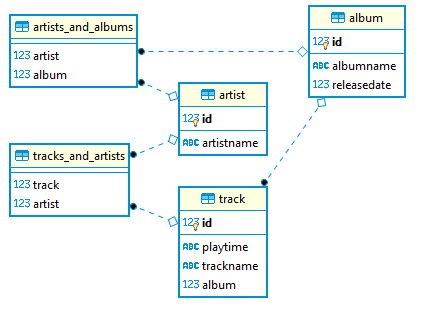

upd: 18.05.2020
## Перед запуском:
Для запуска проекта необходимо прописать настройки для вашей БД в src/main/resources/application.properties (по умолчанию прописаны настройки для БД PostgresSQL). 
## Описание проекта:
Проект представляет собой музыкальную библиотеку, данные которой хранятся в БД PostrgeSQL. Реализованы сущности Track, Album, 
Artist(package: entity). Для каждой сущности реализован Repository-класс(package: repository), посредством которого есть 
возможность выполнять над сущностями операции get, create, update, delete. В проекте реализованы варианты взаимодействия
One-To-Many и Many-To-Many.
В пакете controller реализации контроллеров для сущностей. 

Загрузка тестовых данных в БД производится посредством метода
insertTestData() в TrackService, который выполняется автоматически при запуске SpringApplicationMain. Параметр hibernate.hbm2ddl.auto 
по умолчанию установлен "create".

