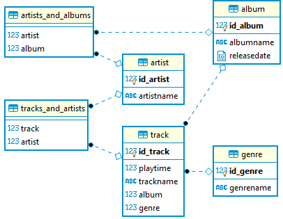

## Перед запуском:
Для запуска проекта необходимо прописать настройки для вашей БД в src/main/resources/META-INF/persistence.xml (по умолчанию прописаны настройки для БД PostgresSQL). После чего в классе Main можно запустить public static void main(String[] args), в котором есть небольшая демонстрация работы проекта.
## Описание проекта:
Проект представляет собой музыкальную библиотеку, данные которой хранятся в БД PostrgeSQL. Реализованы сущности Track, Album, 
Artist, Genre(package: entity). Для каждой сущности реализован класс-контроллер(package: dao), посредством которого есть 
возможность выполнять над сущностями операции get, create, update, delete. В проекте реализованы варианты взаимодействия
One-To-Many и Many-To-Many.

